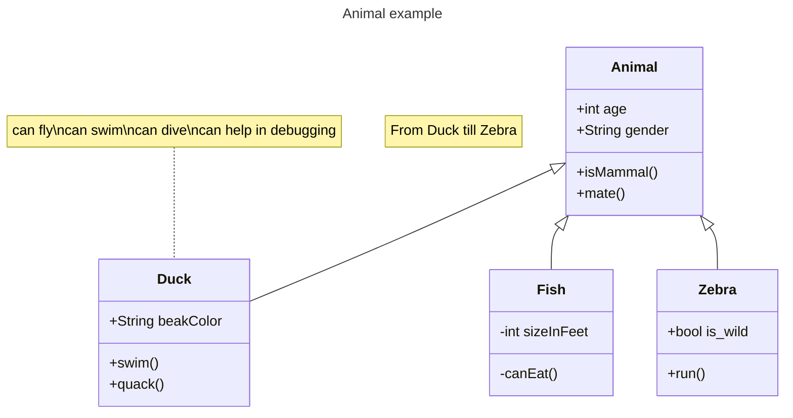
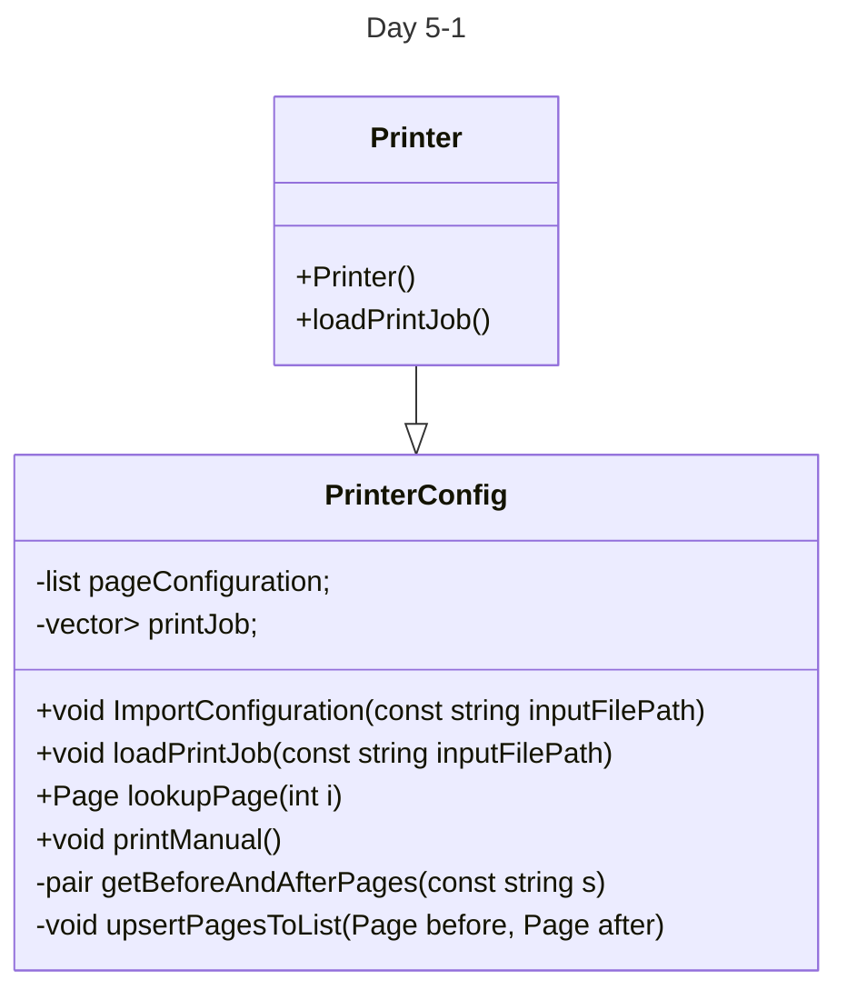

```mermaid
---
title: Animal example
---
classDiagram
    note "From Duck till Zebra"
    Animal <|-- Duck
    note for Duck "can fly\ncan swim\ncan dive\ncan help in debugging"
    Animal <|-- Fish
    Animal <|-- Zebra
    Animal : +int age
    Animal : +String gender
    Animal: +isMammal()
    Animal: +mate()
    class Duck{
        +String beakColor
        +swim()
        +quack()
    }
    class Fish{
        -int sizeInFeet
        -canEat()
    }
    class Zebra{
        +bool is_wild
        +run()
    }
```

```mermaid
---
title: Day 5-1
---
classDiagram
    Printer --|> PrinterConfig
    class Printer {
        +Printer()
        +loadPrintJob()
    }
    class PrinterConfig {
        -list<Page> pageConfiguration;
        -vector<vector<int>> printJob;

        +void ImportConfiguration(const string inputFilePath)
        +void loadPrintJob(const string inputFilePath)
        +Page lookupPage(int i)
        +void printManual()

        -pair<Page, Page> getBeforeAndAfterPages(const string s)
        -void upsertPagesToList(Page before, Page after)
    }

```
